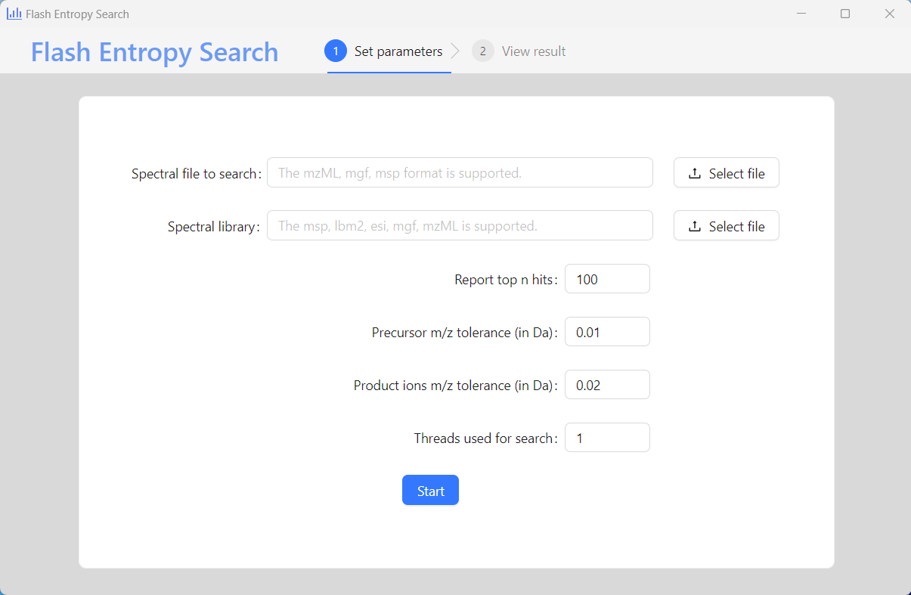
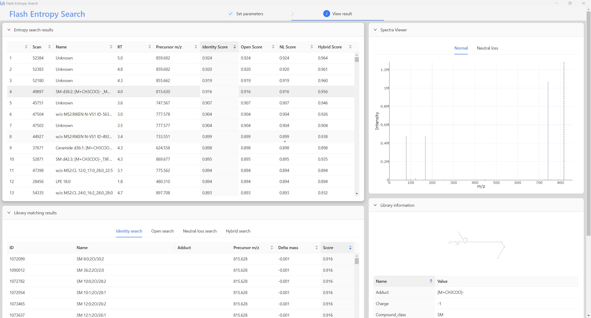

# Flash Entropy Search

This repository contains the source code for Flash Entropy Search, a method using entropy similarity for fast searching mass spectrometry spectral library.

You can find the benchmark results and the original code used in our manuscript under the `manuscript` folder here: [manuscript](https://github.com/YuanyueLi/FlashEntropySearch/tree/main/manuscript).

We are continuously improving the code, and the latest version of the Flash entropy search implementation can be found under the `MSEntropy` repository here: [https://github.com/YuanyueLi/MSEntropy](https://github.com/YuanyueLi/MSEntropy).

You can find find the latest version of the documentation here: [https://msentropy.readthedocs.io/](https://msentropy.readthedocs.io/).

A Graphical user interface (GUI) is also provided here: [https://github.com/YuanyueLi/EntropySearch/releases](https://github.com/YuanyueLi/EntropySearch/releases)


## GUI
You can find the Graphical user interface (GUI) here: [Entropy Search](https://github.com/YuanyueLi/EntropySearch/releases)



## In brief

### Installation

Python >= 3.8, C compiler and Python development headers are required.

```bash
pip install ms_entropy==0.6.0
```

### Usage

```python
from ms_entropy import FlashEntropySearch
entropy_search = FlashEntropySearch()
entropy_search.build_index(spectral_library)
entropy_similarity = entropy_search.search(
    precursor_mz=query_spectrum_precursor_mz, peaks=query_spectrum_peaks)
```

### Explanation

Suppose you have a spectral library, you need to format it like this:

```python
import numpy as np
spectral_library = [{
    "id": "Demo spectrum 1",
    "precursor_mz": 150.0,
    "peaks": [[100.0, 1.0], [101.0, 1.0], [103.0, 1.0]]
}, {
    "id": "Demo spectrum 2",
    "precursor_mz": 200.0,
    "peaks": np.array([[100.0, 1.0], [101.0, 1.0], [102.0, 1.0]], dtype=np.float32),
    "metadata": "ABC"
}, {
    "id": "Demo spectrum 3",
    "precursor_mz": 250.0,
    "peaks": np.array([[200.0, 1.0], [101.0, 1.0], [202.0, 1.0]], dtype=np.float32),
    "XXX": "YYY",
}, {
    "precursor_mz": 350.0,
    "peaks": [[100.0, 1.0], [101.0, 1.0], [302.0, 1.0]]}]
```

Note that the `precursor_mz` and `peaks` keys are required, the reset of the keys are optional.

Then you have your query spectrum looks like this:

```python
query_spectrum = {"precursor_mz": 150.0,
                  "peaks": np.array([[100.0, 1.0], [101.0, 1.0], [102.0, 1.0]], dtype=np.float32)}
```

You can call the `FlashEntropySearch` class to search the library like this:

```python
from ms_entropy import FlashEntropySearch
entropy_search = FlashEntropySearch()
# Step 1: Build the index from the library spectra
spectral_library = entropy_search.build_index(spectral_library)
# Step 2: Search the library
entropy_similarity = entropy_search.search(
    precursor_mz=query_spectrum['precursor_mz'], peaks=query_spectrum['peaks'])
```

After that, you can print the results like this:

```python
import pprint
pprint.pprint(entropy_similarity)
```

The result will look like this:

```python
{'hybrid_search': array([0.6666666 , 0.99999994, 0.99999994, 0.99999994], dtype=float32),
 'identity_search': array([0.6666667, 0.       , 0.       , 0.       ], dtype=float32),
 'neutral_loss_search': array([0.6666666, 0.       , 0.6666666, 0.3333333], dtype=float32),
 'open_search': array([0.6666666 , 0.99999994, 0.3333333 , 0.6666666 ], dtype=float32)}
```

## In detail

We also provided many flexible options for the user to customize the search. You can find a more detailed documentation here: [https://msentropy.readthedocs.io](https://msentropy.readthedocs.io/).
